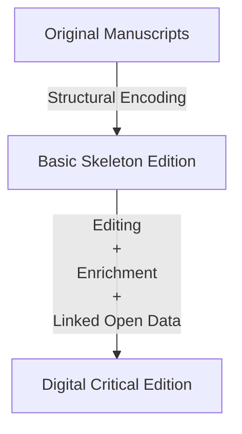

# Digital Leigh Hunt - Digitising the Indicator
Welcome to the Github repository for Digital Leigh Hunt's digitisation and critical edition effort. We are in the process of structurally encoding and editorialising all 76 issues of Leigh Hunt's periodical, *The Indicator*. An ongoing and collaborative effort, we look to have a rich digital edition complete to join the larger digital collection of Leigh Hunt's works.

## Where to Start
If you are a contributor, please take a look at the [reference document](REFERENCE.md) for our TEI guidelines.

The edition we are working from is the 1820 edition [available here](https://archive.org/details/indicatorserial01hunt). A local preserved version is [available here](Source/hunt_theIndicator_source.pdf), and the full-text OCR is [available here](Source/hunt_theIndicator_fullText.txt).

When using the full-text OCR, feel free to use the [Undoubler](undoubler.py) to automate the removal of the double-spacing between words.

There is a TEI template (though subject to change) [available here](teiTemplate.xml), though do make sure to check over the metadata already provided to ensure it is relevant to your particular use case.

The first phase of structural versions are available in the relevant folder.

## Roadmap

##  Workin with remote github repository

- Setting up connection to github repo: 
Type the following commands in order:

git remote add origin https://github.com/pippaJeanne/indicator-leighhunt.git
git remote -v (to verify you have the right one)

- Updating the repo with one or more files:
git add "path/to/file"
git commit -m "message to indicate the kind of update"
git push origin main

